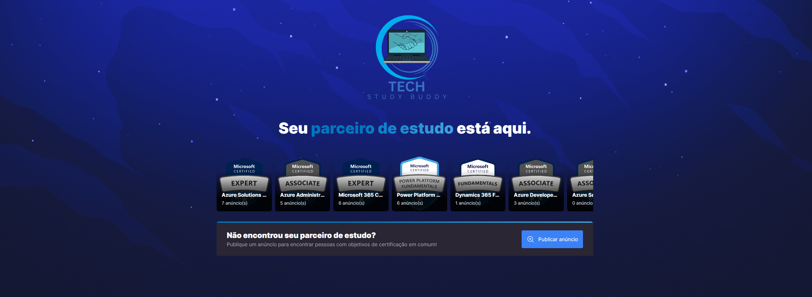
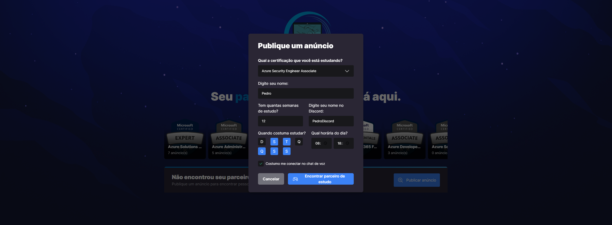

# Tech Study Buddy - Projeto TCC

## Descrição

Tech Study Buddy é uma aplicação web responsiva desenvolvida por Pedro Henrique Fernandes Souza, cujo objetivo é auxiliar profissionais de TI a encontrar parceiros de estudo com interesses similares em certificações Microsoft. A plataforma permite aos usuários criar e gerenciar grupos de estudo, compartilhar recursos e materiais e obter apoio uns dos outros durante o processo de preparação para os exames de certificação.

## Funcionalidades

- Identificar as principais certificações Microsoft e os tópicos de estudo relacionados a cada uma delas
- Desenvolver uma plataforma que facilite a criação e gerenciamento de grupos de estudo focados em certificações Microsoft
- Implementar um sistema de busca e filtragem de usuários com base em suas preferências e objetivos de estudo

## Tecnologias utilizadas

- Vite
- TypeScript
- React
- react-dom
- react-router-dom
- Axios
- react-toastify
- Keen Slider
- Radix UI
- @hookform/resolvers
- phosphor-react
- Tailwind CSS
- autoprefixer
- postcss
- tailwind-scrollbar
- @vitejs/plugin-react

## Como executar o projeto

1. Certifique-se de ter o Node.js (versão recomendada ou superior) instalado em seu sistema
2. Clone o repositório: `https://github.com/pedrosouza423/tech-study-buddy-tcc`
3. Navegue até o diretório do projeto e instale as dependências com `npm install`
4. Inicie o servidor de desenvolvimento com `npm run dev`
5. Abra seu navegador web moderno (Chrome, Firefox, Safari ou Edge) e acesse `http://localhost:3000`

## Contribuição

Sinta-se à vontade para contribuir com melhorias e expansões no projeto, como adicionar funcionalidades que facilitem o encaminhamento direto para parceiros ou equipes com interesses em certificações específicas, aprofundar o entendimento dos frameworks não utilizados (Node e React Native) para desenvolver um sistema de login mais robusto e criar uma versão do aplicativo específica para dispositivos móveis.

## Licença

Este projeto está licenciado sob a [MIT License](LICENSE).
